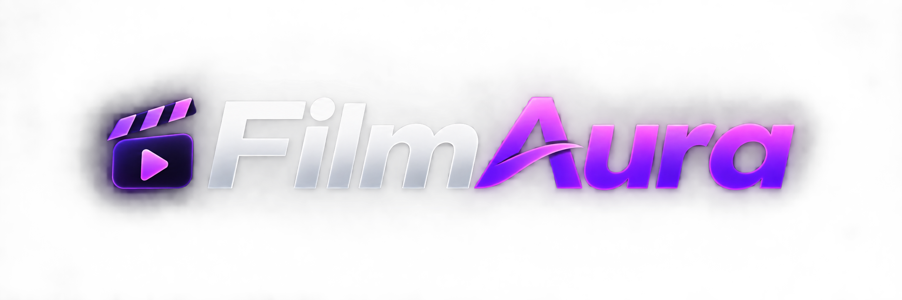
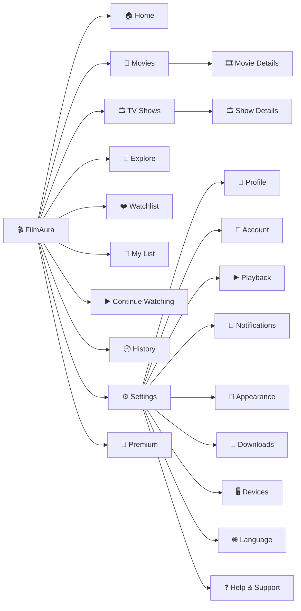
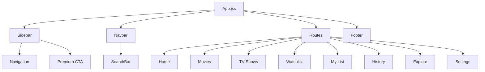

# 🎬 FilmAura

<p align="center">
  
</p>

<h3 align="center">
  A Modern OTT Streaming Experience
</h3>

<p align="center">
  
</p>

<p align="center">
  <a href="#">
    
  </a>
  <a href="#">
    
  </a>
</p>

<p align="center">
  
  
  
  
  
</p>

---

## ✨ About FilmAura

**FilmAura** is a modern OTT streaming web application built with **React.js** and designed around a clean, immersive and responsive entertainment experience.

The interface combines a deep dark theme with subtle purple accents, smooth interactions, responsive layouts and a collapsible navigation system.

> 🎥 **Discover. Watch. Save. Continue. Enjoy.**

FilmAura is designed to feel like a complete OTT platform while keeping the frontend architecture clean, reusable and scalable.

---

## 🎞️ What Makes FilmAura Different?

<table>
<tr>
<td width="50%">

### 🎨 Premium UI

Clean dark interface with:

- Purple accent system
- Glass-like surfaces
- Smooth transitions
- Rounded components
- Subtle gradients
- Modern typography

</td>

<td width="50%">

### 📱 Fully Responsive

Designed for:

- 🖥️ Desktop
- 💻 Laptop
- 📱 Tablet
- 📱 Mobile

The layout automatically adapts to different screen sizes.

</td>
</tr>

<tr>
<td width="50%">

### 🧭 Smart Navigation

Includes:

- Collapsible sidebar
- Active navigation state
- Responsive navbar
- Search interface
- Profile section
- Notification UI

</td>

<td width="50%">

### 🍿 OTT Experience

Includes dedicated sections for:

- Movies
- TV Shows
- Watchlist
- My List
- History
- Continue Watching
- Explore

</td>
</tr>
</table>

---

## 🚀 Features

### 🎬 Entertainment

- 🎥 Movies
- 📺 TV Shows
- 🔎 Explore
- ❤️ Watchlist
- 🔖 My List
- ▶️ Continue Watching
- 🕘 Watch History

### 👤 User Experience

- Profile interface
- Account settings
- Notifications
- Playback settings
- Appearance settings
- Device management
- Language settings
- Downloads
- Help & Support

### 💎 Premium Experience

- Premium membership section
- Upgrade CTA
- Exclusive benefits UI
- Subscription-oriented design

### 🧩 UI Components

- Responsive Sidebar
- Collapsible Sidebar
- Navbar
- Search Bar
- Footer
- Navigation states
- Premium cards
- Responsive content layouts

---

# 🖥️ UI Preview

> Add your screenshots inside the `screenshots` folder.

### 🏠 Home

<p align="center">
  
</p>

---

### 🎬 Movies

<p align="center">
  
</p>

---

### 📺 TV Shows

<p align="center">
  
</p>

---

### ❤️ Watchlist

<p align="center">
  
</p>

---

### ⚙️ Settings

<p align="center">
  
</p>

---

# 🧠 Application Flow



---

# 🛠️ Tech Stack

<div align="center">

| Technology | Purpose |
|---|---|
| ⚛️ React.js | UI development |
| 🎨 Tailwind CSS | Styling & responsive design |
| 🧭 React Router DOM | Application routing |
| 🎯 Lucide React | Interface icons |
| ⚡ Vite | Development & build tool |
| 💻 JavaScript | Application logic |
| 🧩 CSS `@layer` | Component styling |

</div>

---

# 🎨 Design System

FilmAura uses a dark cinematic interface with purple highlights.

| Element | Design |
|---|---|
| 🌑 Background | `#07070d` |
| 🖤 Surface | `#10101a` |
| 🪟 Cards | `#0c0c14` |
| 🔲 Borders | `#29293a` |
| 🟣 Primary | Purple |
| 💜 Accent | Violet |
| 🤍 Primary Text | White |
| 🌫️ Secondary Text | Gray |

### Design Principles

```text
Minimal
   ↓
Clean
   ↓
Consistent
   ↓
Responsive
   ↓
Interactive
   ↓
Premium
```

---

# 📱 Responsive Architecture

FilmAura adapts its layout according to the device size.

| Device | Sidebar Open | Sidebar Closed |
|---|---:|---:|
| 🖥️ Desktop | 280px | 82px |
| 💻 Laptop | 250px | 76px |
| 📱 Tablet | 220px | 72px |
| 📱 Mobile | 200px | 64px |

### Sidebar Behavior

```text
                 SIDEBAR OPEN

┌──────────────────┬─────────────────────────────┐
│                  │          Navbar             │
│                  ├─────────────────────────────┤
│                  │                             │
│     SIDEBAR      │                             │
│                  │          Content            │
│      280px       │                             │
│                  │                             │
│                  ├─────────────────────────────┤
│                  │           Footer            │
└──────────────────┴─────────────────────────────┘
```

```text
                 SIDEBAR CLOSED

┌───────┬────────────────────────────────────────┐
│       │               Navbar                   │
│       ├────────────────────────────────────────┤
│ ICONS │                                        │
│       │                Content                 │
│ 82px  │                                        │
│       │                                        │
│       ├────────────────────────────────────────┤
│       │                Footer                  │
└───────┴────────────────────────────────────────┘
```

The main content automatically expands when the sidebar is collapsed.

---

# 📂 Project Structure

```text
filmAura-ott/
│
├── 📁 public/
│
├── 📁 src/
│   │
│   ├── 📁 assets/
│   │   └── filmaura_logo.png
│   │
│   ├── 📁 components/
│   │   ├── Sidebar.jsx
│   │   ├── Navbar.jsx
│   │   ├── SearchBar.jsx
│   │   └── Footer.jsx
│   │
│   ├── 📁 pages/
│   │   ├── HomePage.jsx
│   │   ├── MoviesPage.jsx
│   │   ├── ShowsPage.jsx
│   │   ├── MyListPage.jsx
│   │   ├── WatchlistPage.jsx
│   │   ├── ContinueWatchingPage.jsx
│   │   ├── HistoryPage.jsx
│   │   ├── ExplorePage.jsx
│   │   ├── SettingsPage.jsx
│   │   └── HelpPage.jsx
│   │
│   ├── App.jsx
│   ├── main.jsx
│   └── index.css
│
├── 📄 .gitignore
├── 📄 package.json
├── 📄 package-lock.json
├── 📄 vite.config.js
└── 📄 README.md
```

---

# 🧭 Application Routes

| Route | Page |
|---|---|
| `/` | 🏠 Home |
| `/movies` | 🎬 Movies |
| `/shows` | 📺 TV Shows |
| `/my_list` | 🔖 My List |
| `/watchlist` | ❤️ Watchlist |
| `/continue_watching` | ▶️ Continue Watching |
| `/history` | 🕘 History |
| `/explore` | 🔎 Explore |
| `/settings` | ⚙️ Settings |
| `/help` | ❓ Help & Support |
| `/plans` | 💎 Premium Plans |

---

# 🧩 Component Architecture



---

# ⚙️ Installation

## 1️⃣ Clone the Repository

```bash
git clone https://github.com/abhishekkjaiml/filmAura-ott.git
```

## 2️⃣ Navigate to the Project

```bash
cd filmAura-ott
```

## 3️⃣ Install Dependencies

```bash
npm install
```

## 4️⃣ Start Development Server

```bash
npm run dev
```

---

# 👨‍💻 Author

<h3 align="center">
  Abhishek Kumar Jaiswar
</h3>

<p align="center">
  <b>B.Tech CSE | React.js Developer | Frontend Developer</b>
</p>

<p align="center">
  Building modern, responsive and user-focused web experiences
  with React.js and modern web technologies.
</p>

<p align="center">

<a href="https://github.com/abhishekkjaiml">
  
</a>

<a href="https://www.linkedin.com/in/abhishek-kumar-jaiswar-aiml/">
  
</a>

</p>

---

# 🔗 Connect With Me

<p align="center">

<a href="https://github.com/abhishekkjaiml">
  
</a>

<a href="https://www.linkedin.com/in/abhishek-kumar-jaiswar-aiml/">
  
</a>

</p>

---

<p align="center">

<b>🎬 FilmAura — Stream. Discover. Enjoy.</b>

</p>

<p align="center">
  Made with ❤️ using React.js
</p>

<p align="center">


</p>